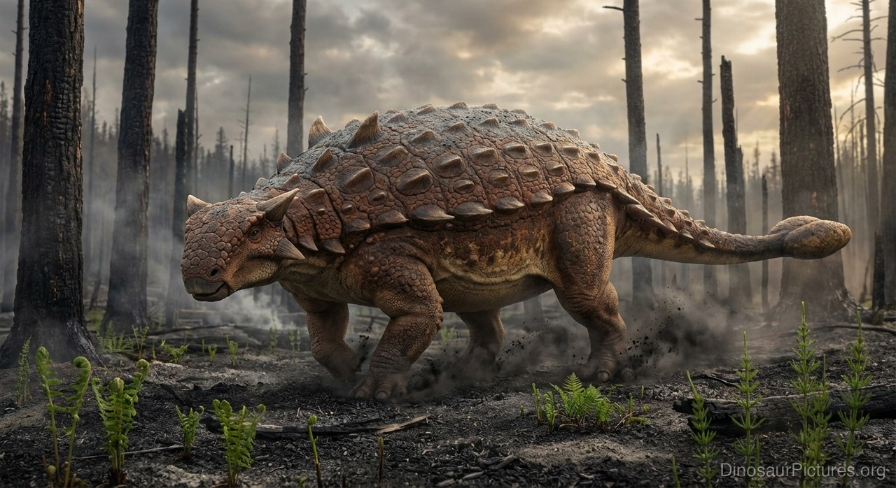

# Atividade Prática - Cards, Flexbox e Navegação

Projeto desenvolvido utilizando **HTML e CSS** com o objetivo de praticar a criação de páginas, estilização de cards, utilização de **Flexbox** e navegação entre diferentes arquivos HTML.

O projeto possui uma página de cadastro e uma página principal com cards de animais pré-históricos, contendo imagem, título e informações adicionais.

---

## Funcionalidades

* **Página de Cadastro:** Formulário contendo campos para nome, e-mail e senha.
* **Navegação entre Páginas:** Utilização da tag `<a>` para acessar a página principal.
* **Cards com Flexbox:** Os cards são organizados utilizando `display: flex`.
* **Quebra Automática dos Cards:** Utilização de `flex-wrap` para adaptar os cards ao espaço disponível.
* **Imagens nos Cards:** Cada animal possui sua própria imagem.
* **Informações Expansíveis:** Utilização das tags `<details>` e `<summary>`.
* **Cards Pares e Ímpares:** Utilização de `nth-child()` para aplicar estilos diferentes.
* **Efeito Hover:** Os cards possuem animação ao passar o mouse.
* **CSS Externo:** A estilização das páginas está separada dos arquivos HTML.

---

## Tecnologias Utilizadas

* **HTML5**
* **CSS3**
* **Flexbox**
* **Pseudo-classes CSS**
* **`nth-child()`**
* **`:hover`**
* **`details` e `summary`**
* **Formulários HTML**
* **Navegação com `<a>`**

---

## Estrutura do Projeto

```text
projeto/
│
├── paginas/
│   ├── cadastro.html
│   └── index.html
│
├── style/
│   ├── cadastro.css
│   └── index.css
│
└── imagem/
    ├── Ankylosaurus.jpg
    ├── spimming-spinosaurus.jpg
    ├── anomalocaris.webp
    ├── Quetzalcoatlus_62ead9db.jpg
    └── Velociraptor.jpg
```

---

# Página de Cadastro

A primeira página possui um formulário básico de cadastro.

Os dados solicitados são:

```text
Nome
E-mail
Senha
```

A estrutura principal é:

```html
<div class="containerCadastro">
    <form>
        <h1>Cadastro</h1>

        <label for="nome">Nome</label>
        <input type="text" id="nome" required />

        <label for="email">E-mail</label>
        <input type="email" id="email" required />

        <label for="senha">Senha</label>
        <input type="password" id="senha" required />

        <button type="submit">Cadastrar</button>

        <a href="index.html">Avançar</a>
    </form>
</div>
```

---

## Estilização do Cadastro

O formulário é centralizado horizontalmente e verticalmente utilizando Flexbox:

```css
.containerCadastro {
    min-height: 100vh;

    display: flex;
    justify-content: center;
    align-items: center;
}
```

O formulário também utiliza:

```css
form {
    width: 300px;

    display: flex;
    flex-direction: column;

    padding: 25px;

    background-color: white;

    border: 1px solid #cccccc;
    border-radius: 10px;

    box-shadow: 0 4px 8px rgba(0, 0, 0, 0.15);
}
```

O:

```css
flex-direction: column;
```

faz com que os elementos sejam organizados verticalmente.

---

# Página Principal

A página principal apresenta cards de animais pré-históricos.

Os animais utilizados são:

* Ankylosaurus
* Spinosaurus
* Anomalocaris
* Quetzalcoatlus
* Velociraptor

Cada card possui:

```text
Imagem
Título
Informações
```

---

## Estrutura de um Card

Um card segue a seguinte estrutura:

```html
<div class="card">

    

    <h2>Ankylosaurus</h2>

    <details>
        <summary>Ver informações</summary>

        <p>
            Informações sobre o Ankylosaurus.
        </p>
    </details>

</div>
```

A mesma estrutura é utilizada para os outros animais.

---

# Cards com Flexbox

Os cards são organizados dentro do:

```html
<div class="containerCard">
```

No CSS:

```css
.containerCard {
    display: flex;
    justify-content: center;
    gap: 20px;
    flex-wrap: wrap;
}
```

O:

```css
display: flex;
```

ativa o Flexbox.

O:

```css
justify-content: center;
```

centraliza os cards.

O:

```css
gap: 20px;
```

adiciona espaço entre eles.

E:

```css
flex-wrap: wrap;
```

permite que os cards passem para outra linha caso não exista espaço suficiente.

---

# Estilização dos Cards

Cada card possui:

```css
.card {
    width: 170px;
    min-height: 240px;

    border: 1px solid #cccccc;
    border-radius: 10px;

    padding: 10px;

    background-color: white;

    box-shadow: 0 4px 8px rgba(0, 0, 0, 0.15);

    transition: 0.3s;
}
```

Isso define:

```text
Largura
Altura mínima
Borda
Arredondamento
Espaçamento interno
Cor de fundo
Sombra
Transição
```

---

# Imagens dos Cards

As imagens utilizam:

```css
.card img {
    width: 100%;
    height: 110px;

    object-fit: cover;

    border-radius: 7px;
}
```

O:

```css
width: 100%;
```

faz a imagem ocupar toda a largura disponível no card.

Já:

```css
object-fit: cover;
```

faz a imagem preencher o espaço definido sem deformar sua proporção.

---

# Details e Summary

As informações adicionais são exibidas utilizando:

```html
<details>
    <summary>Ver informações</summary>

    <p>
        Informações sobre o animal.
    </p>
</details>
```

O `<summary>` funciona como a parte clicável.

Quando o usuário clica em:

```text
Ver informações
```

o conteúdo presente dentro de `<details>` é expandido.

---

# Cards Pares e Ímpares

O projeto utiliza:

```css
.card:nth-child(even) {
    background-color: #eeeeee;
}

.card:nth-child(odd) {
    background-color: white;
}
```

O:

```css
:nth-child(even)
```

seleciona os elementos em posições pares:

```text
2
4
6
8
...
```

Já:

```css
:nth-child(odd)
```

seleciona os elementos em posições ímpares:

```text
1
3
5
7
...
```

Dessa forma, os cards podem possuir cores alternadas.

---

# Efeito Hover

Também foi utilizado:

```css
.card:hover {
    transform: translateY(-8px);

    box-shadow: 0 8px 16px rgba(0, 0, 0, 0.25);
}
```

O:

```css
:hover
```

é ativado quando o usuário posiciona o mouse sobre o card.

O comando:

```css
transform: translateY(-8px);
```

move o card 8 pixels para cima.

A sombra também é aumentada:

```css
box-shadow: 0 8px 16px rgba(0, 0, 0, 0.25);
```

criando um efeito visual de destaque.

---

# Navegação entre Páginas

Na página de cadastro existe:

```html
<a href="index.html">Avançar</a>
```

A tag:

```html
<a>
```

é utilizada para criar links.

O atributo:

```html
href="index.html"
```

indica qual página será aberta.

O fluxo fica:

```text
cadastro.html
      |
      | Avançar
      v
 index.html
      |
      v
 Cards dos animais
```

---

# Animais Utilizados

## Ankylosaurus

Animal pré-histórico utilizado no primeiro card.

Arquivo:

```text
Ankylosaurus.jpg
```

## Spinosaurus

Animal utilizado no segundo card.

Arquivo:

```text
spimming-spinosaurus.jpg
```

## Anomalocaris

Animal pré-histórico marinho utilizado no terceiro card.

Arquivo:

```text
anomalocaris.webp
```

## Quetzalcoatlus

Animal voador utilizado no quarto card.

Arquivo:

```text
Quetzalcoatlus_62ead9db.jpg
```

## Velociraptor

Animal utilizado no quinto card.

Arquivo:

```text
Velociraptor.jpg
```

---

# Conceitos Praticados

Durante o desenvolvimento do projeto foram utilizados conceitos de:

```text
HTML
│
├── div
├── form
├── label
├── input
├── button
├── a
├── img
├── h1
├── h2
├── p
├── details
└── summary

CSS
│
├── Flexbox
├── margin
├── padding
├── border
├── border-radius
├── box-shadow
├── gap
├── flex-wrap
├── object-fit
├── transition
├── transform
├── :hover
└── :nth-child()
```

---

# Fluxo do Projeto

```text
Usuário
   |
   v
cadastro.html
   |
   ├── Nome
   ├── E-mail
   └── Senha
   |
   v
"Avançar"
   |
   v
index.html
   |
   v
containerCard
   |
   ├── Ankylosaurus
   ├── Spinosaurus
   ├── Anomalocaris
   ├── Quetzalcoatlus
   └── Velociraptor
          |
          v
   "Ver informações"
```

---

# PROPOSTA

<!-- Coloque aqui a imagem da atividade -->


---

# RESULTADO

<!-- Coloque aqui imagens do resultado final -->


---
